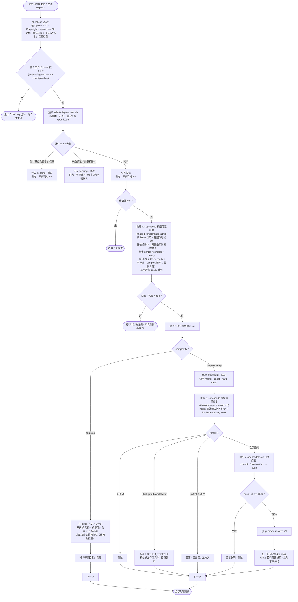

# opencode issue 自动化

仓库有两类 opencode 自动化，共享同一套模型配置与标签语义：

- **事件驱动（按需）**：人在 issue / PR 里用 `/opencode`、`/oc` 触发；开 PR 自动触发评审；在 PR 评论里用 `/review-oc`（opencode）或 `/review-cc`（Claude Code）按需触发一次评审。
- **每日定时扫描**：每天定时遍历 open issue，自动挑选并处理，最多 3 个。

两者都用 `anomalyco/opencode` 这套 CLI / action，模型由仓库变量 `OPENCODE_MODEL` 指定，鉴权用 secret `OPENCODE_API_KEY`，CI 内统一加载 `.github/opencode-ci.json`（放行仓库目录外访问，避免卡在权限确认）。

> **统一评审标准**：自动评审与 `/review-oc`、`/review-cc` 三处共用同一份评审 prompt `.github/review-prompt.md`（聚焦正确性 / bug、与 `CLAUDE.md` 约定一致性，并检查**相关说明文档是否随代码同步更新**——`docs/superpowers/` 除外）。改评审标准只改这一个文件即可。

---

## 1. 事件驱动（`.github/workflows/opencode.yml` + `ci.yml` + `claude.yml`）

| 触发 | 行为 | 结束后打的标签 |
|---|---|---|
| issue **正文/标题**含 `/opencode`、`/oc`（`issues: opened/edited`） | 读 issue 需求/缺陷 → 新分支实现/修复 → 开 PR | 新开了 PR → `已自动修复`；否则（仅回复/失败）→ `等待回复` |
| **issue 评论**含 `/opencode`、`/oc`（`issue_comment: created`） | 执行评论里的指令（不预设 prompt，避免覆盖） | `等待回复`（仅对 issue，PR 评论不打） |
| **PR 评论**含 `/opencode`、`/oc` | 执行评论指令 | —（PR 上不打 issue 标签） |
| 开 / 重开 PR（`ci.yml` 的 `review` job） | 测试 + 冒烟通过后，自动中文评审（统一 prompt） | —（评审为评论） |
| **PR 评论**含 `/review-oc`（`opencode.yml` 的 `review` job） | opencode 按统一 prompt 做一次只读评审，按需重复触发 | —（评审为评论） |
| **PR 评论**含 `/review-cc`（`claude.yml` 的 `review` job） | Claude Code 按统一 prompt 做一次评审，按需重复触发 | —（评审为评论） |

> `/review-oc`、`/review-cc` 与 `/opencode`、`/oc`、`@claude` 触发串互不包含，互不误触；`/review-*` 仅对 **PR 评论**生效（`issue_comment` 上用 `github.event.issue.pull_request` 过滤，叠加 `pull_request_review_comment`），且为**只读评审不改代码**，故不装 Python / Playwright。

要点：

- **机器人自触发被排除**：所有 job 都先排除 `opencode-agent`、`opencode-agent[bot]`（真实账号是裸 `opencode-agent`，CONTRIBUTOR，非 `[bot]` App，两种都要挡）。
- **按需流程也装 Python + Playwright**，让 opencode 改完代码能本地跑 `pytest`（含 Playwright UI 测试）自验后再开 PR。
- `review` job **跳过 `synchronize`**（每次 push 不重复评审），且**跳过 bot 开的 PR**——bot 作者权限为 none，评审会在权限闸门必然失败（见 PR #43）。所以 bot（含定时 triage / 按需 issue 流程）开的 PR 不会被自动评审；它们已在开 PR 前本地跑过 `pytest`。

---

## 2. 每日定时扫描（`.github/workflows/opencode-scheduled.yml`）

每天 **北京时间 02:00**（cron `0 18 * * *` UTC）触发，也可手动 `workflow_dispatch`（带 `dry_run` 选项）。同名 `concurrency` 组保证不与上一次运行重叠。

工作流装好 Python 3.12 + Playwright + opencode CLI、确保两个标签存在后，调 `scripts/opencode-triage.sh` 跑主流程。

### 流程图

### 各环节细节

0. **Backlog 闸门**（`select-triage-issues.sh count-pending`）：当前「待人工处理」issue 已达 **3 条**（`PENDING_LIMIT`）则本次直接结束，避免积压。
   「待人工处理（pending）」= 满足任一：
   - 带 `已自动修复` 标签且 issue 仍打开（PR 等人类审阅/合并）；
   - **最后一条评论作者是机器人**（定时 / 按需任一流程已回复，在等人类答复）。
1. **预筛**（同一脚本，默认 `candidates` 模式，**纯脚本无 AI**）：遍历全部 open issue，按上面同一规则剔除两类 pending，其余为候选，按创建时间升序输出 `[{number,title,body,comments,question_rounds}]`。
   - **每个候选带完整评论线程 `comments`（`{author,body}` 顺序数组）与 `question_rounds`**（评论里含隐藏提问标记 `<!-- triage:question -->` 的条数）——供阶段 A 读问答历史、按人类答复判断，并据已问轮数守回合上限。
   - 判定「等人类」**只看末条评论作者是不是机器人，不依赖 `等待回复` 标签**——这样 `/oc` 等按需流程即便没打标签也能被正确跳过；人类回复后（末评论变人类）自动重新纳入候选。
   - 机器人账号：`opencode-agent` / `opencode-agent[bot]` / `github-actions` / `github-actions[bot]`，以及任意 `*[bot]` App。
   - 脚本对每个 issue 的「跳过 / 入选」决定**逐条打 stderr 诊断日志**（进 workflow 日志），便于事后确认是哪个 issue、因哪条规则被拦在 AI 之前。
2. **阶段 A**（只读模型评估，`scripts/triage-prompts/stage-a.md`）：通读全部候选（**含 `comments` 问答线程**），**先按技术依赖关系排序（前置项在前），再在此前提下按从简单到复杂排序**，取前 3，逐个判 `simple` / `complex` / `ready`：
   - `simple`：需求本就明确，直接实现；
   - `complex`：需先澄清——首次提问列出待定点，或在人类已答但仍有点没说清时**只追问未决点**（每个待定点给 2~3 个备选项）；
   - `ready`：此前问过、人类已答且**答复足以动手**（或已达回合上限带合理假设推进），产出 `implementation_notes`（方案映射）交给阶段 B。

   **「是否已问过/已答」以 `comments` 实际内容为准、不只看 `question_rounds`（旧 issue 的历史提问可能无标记）；最多问 2 轮，到上限即带合理假设转 `ready`。** 输出严格 JSON；解析失败则当天跳过、不写。
3. **执行**（`scripts/opencode-triage.sh`）：
   - `complex` → 在 issue 下发评论（**开头标「第 N 轮提问」、末尾埋隐藏标记 `<!-- triage:question -->` 供计回合数**）+ 打 `等待回复` 标签；
   - `simple` / `ready` → 先摘 `等待回复` 标签 → 切回干净 `master` → 模型实现修复（阶段 B，`stage-b.md`；**`ready` 额外喂入问答记录 + `implementation_notes`，要求严格照人类已确认的方案实现**）→ **三道自检闸门**（无改动 / 改到 `.github/workflows/` / `pytest` 不过 → 各自回滚+留言+跳过）→ 建 `opencode/issue<N>-<时间戳>` 分支 + commit + push → 开 PR（`resolve #N`）→ 打 `已自动修复` 标签。push / 开 PR 失败都只留言+跳过，不让整轮崩。
   - **`ready` 若带「假设说明」评论，待 PR 成功开出后才贴**——否则实现失败会让末评论变机器人，使该 issue 被预筛永久判为 pending、不再自动重试（与 `simple` 失败后仍会重试保持一致）。

手动测试：Actions → `opencode-scheduled` → Run workflow，勾选 `dry_run` 只跑到阶段 A 并打印计划，不做任何写操作。

### 标签（工作流首次运行会自动创建）

| 标签 | 含义 | 解除 |
|---|---|---|
| `等待回复` | opencode 已就该 issue 提问，等待人类答复 | 人类在 issue 下回复后（末评论变人类）自动重新纳入候选；下次自动修复 `simple` 路径也会先摘除 |
| `已自动修复` | opencode 已为该 issue 开出修复 PR | PR 合并关闭 issue 即离开范围；PR 被拒时手动移除标签可重触发 |

> 注意：预筛**跳过**与否由「末条评论作者是否机器人」决定，标签只是给人看的状态标记，不参与跳过判定。

### 需要的 Secrets / Variables

事件驱动与定时扫描**共用**，无需为定时任务新增：

| 类型 | 名称 | 用途 |
|---|---|---|
| Secret | `OPENCODE_API_KEY` | opencode CLI / action 鉴权 |
| Variable | `OPENCODE_MODEL` | 使用的模型 id |

`GITHUB_TOKEN` 由 Actions 自动提供（定时工作流声明 `contents/issues/pull-requests: write`）。

### 已知权衡

- 自动修复 PR 由 `GITHUB_TOKEN` 创建，**不会触发** `ci.yml`（GitHub 防工作流嵌套），又因 `review` job 显式跳过 bot PR——与现状一致；阶段 B 已在开 PR 前本地跑过 `pytest`。若希望自动修复 PR 也跑测试+评审，可改用 PAT（如 `secrets.GH_PAT`）创建 PR。
- `GITHUB_TOKEN` **无权推送 `.github/workflows/` 下的改动**，故阶段 B 若改到工作流文件会被提前识别、回滚并留言交人工。
- 阶段 A 要求模型输出严格 JSON；解析失败则当天跳过（不做任何写操作）。

---

## 相关文件

| 文件 | 职责 |
|---|---|
| `.github/workflows/opencode.yml` | 事件驱动：`/oc`、`/opencode` 触发的评论 / issue 处理；`/review-oc` PR 评论评审 |
| `.github/workflows/claude.yml` | `@claude` 通用唤起；`/review-cc` PR 评论用 Claude Code 评审 |
| `.github/workflows/ci.yml` | PR 测试（含 `_checks.yml`）+ `review` job 自动评审 |
| `.github/review-prompt.md` | 统一评审 prompt（自动评审 / `/review-oc` / `/review-cc` 共用） |
| `.github/workflows/opencode-scheduled.yml` | 每日定时 triage 的工作流外壳 |
| `.github/opencode-ci.json` | CI 专用 opencode 配置（放行非交互工具 / 外部目录） |
| `scripts/opencode-triage.sh` | 定时 triage 主流程（闸门→预筛→阶段A→执行） |
| `scripts/select-triage-issues.sh` | 预筛 / count-pending（纯脚本分类，逐条诊断日志） |
| `scripts/triage-prompts/stage-a.md` | 阶段 A：读问答线程 + 评估排序 + 三态判定（simple/complex/ready）+ 起草评论的 prompt |
| `scripts/triage-prompts/stage-b.md` | 阶段 B：按 implementation_notes / 已确认方案实现修复的 prompt |
